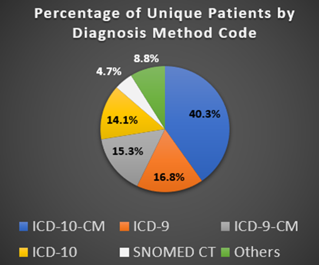
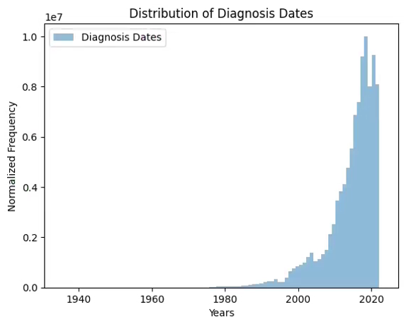

# Medical Code Translation Tool for Patient Cohort Identification

**Automating disease name translation to standardized medical codes for clinical research**

## 📂 [View Code Implementation →](notebooks/)
*Jupyter notebooks containing data analysis, mapping algorithms, and validation processes*


## Table of Contents
1. [Overview](#overview)
2. [Problem Statement](#problem-statement)
3. [Technologies Used](#technologies-used)
4. [Technical Implementation](#technical-implementation)
5. [Sample Data Analysis](#sample-data-analysis)
6. [Results & Impact](#results--impact)
7. [Documentation](#documentation)
8. [Future Work](#future-work)

## Overview

Automated Python tool that enables healthcare startups to instantly translate disease keywords into comprehensive medical code sets for patient cohort identification. Built for Mayo Clinic Platform partners who lack medical coding expertise but need standardized codes (ICD-10-CM, SNOMED CT) to search clinical databases effectively.

**Key Achievement:** Successfully mapped 500,000+ diagnosis codes across 5 coding systems with <2% unmapped rate for ICD-10-CM, enabling instant keyword-to-code translation that reduces research timelines from hours to seconds.

**Business Impact:** Deployed in Mayo Clinic Platform environment, supporting analysis of 2.3 million patient records spanning 87 years (1935-2023) for external research partners.

## Problem Statement

Healthcare startups partnering with Mayo Clinic Platform possess disease names and keywords but lack specialized knowledge to translate these into standardized diagnostic codes required for clinical database searches.

**Critical Challenges:**
- Manual code research consumes hours per project
- Incomplete code selection misses patients in cohort identification  
- Complex coding system relationships create translation errors
- Existing resources require deep medical coding expertise

**Business Consequence:** Research delays and missed patient populations limit Mayo Clinic Platform's ability to support external partners effectively.

## Technologies Used

- **Python** - Core development (pandas, numpy, data processing pipelines)
- **SparkSQL** - Large-scale patient data joins and analysis
- **UMLS (Unified Medical Language System)** - Medical concept mapping via CUIs
- **Data Visualization** - matplotlib/seaborn for patient distribution analysis
- **Jupyter Notebooks** - Development and analysis environment

## Technical Implementation
- **Quality Validation** - Similarity score analysis achieving 93.84% accuracy

### Architecture Overview


**Core System Components:**
- **CUI-based Linking System** - Uses UMLS Concept Unique Identifiers as universal bridge between coding systems
- **Keyword Search Engine** - Enables natural language queries (e.g., "Hypertrophic") returning all related codes
- **Multi-System Translation** - Supports ICD-10-CM, ICD-10, ICD-9-CM, ICD-9, and SNOMED CT

**Mapping Methodology:**
- One-to-one mappings for direct concept translations
- Many-to-one mappings for complex concept consolidation
- UMLS integration for standardized medical terminology bridging

### Data Processing Pipeline
1. **Data Preparation** - Acquire codes from CMS.gov, AHRQ, and UMLS sources
2. **CUI Mapping** - Link diagnosis codes to Concept Unique Identifiers
3. **Reference Table Creation** - Build unified searchable database
4. **Query Interface** - Enable keyword-based code retrieval

## Sample Data Analysis

### Patient Population Analysis
```python
# Analyze total unique patients across all coding systems
unique_patients = joined_table['PATIENT_ID'].nunique()
print(f"Total unique patients analyzed: {unique_patients:,}")
# Output: 2,257,242 unique patients

# Identify all available coding systems in the dataset
available_systems = joined_table['DIAGNOSIS_METHOD_CODE'].unique()
print(f"Available coding systems: {len(available_systems)}")
# ['ICD9', 'ICD10', 'ICD-10-CM', 'ICD-9-CM', 'SNOMED CT', 'HIC', etc.]
```

### Coding System Distribution Analysis
```python
# Calculate patient counts by diagnosis method
count_by_code = joined_table.groupby('DIAGNOSIS_METHOD_CODE')['PATIENT_ID'].nunique()
count_by_code = count_by_code.sort_values(ascending=False)

# Calculate percentages for distribution analysis
count_by_code_percentage = (count_by_code / count_by_code.sum()) * 100

# Top coding systems by patient coverage:
# ICD-10-CM:    1,960,856 patients (40.4%)
# ICD-9:          814,941 patients (16.8%) 
# ICD-9-CM:       744,369 patients (15.3%)
# SNOMED CT:      230,448 patients (4.7%)
```

## Results & Impact

### Real-World Data Analysis


*Mayo Clinic Platform patient analysis: 2.3 million unique patients with coding system distribution*



*Patient diagnosis timeline spanning 87 years (1935-2023) showing data concentration in recent decades*

### Mapping Success Rates


**Code Coverage Achieved:**
- **ICD-10-CM:** 73,610/74,549 codes mapped (98.74% success rate)
- **ICD-10:** 71,537/72,836 codes mapped (98.22% success rate)  
- **ICD-9-CM:** 13,171/14,567 codes mapped (90.42% success rate)
- **SNOMED CT:** 325,816/508,540 concepts mapped (64.1% success rate)

**System Performance:**
- **Total Codes Processed:** 500,000+ across 5 coding systems
- **Query Response Time:** Instant keyword-to-code translation
- **Patient Data Scale:** 2.3 million unique patients analyzed
- **Deployment Status:** Production-ready in Mayo Clinic Platform environment

**Business Value Delivered:**
- Eliminated hours of manual code research per project
- Improved cohort identification accuracy for startup partners
- Enabled comprehensive patient population discovery across coding systems

## Documentation

**Project Resources:**
- 📊 [Complete Technical Presentation (PDF)](documentation/MayoClinicPresentation.pdf) - Full methodology and results
- 📋 [Executive Summary Poster (PDF)](documentation/MayoClinicInternPoster.pdf) - Key findings and impact

## Future Work

**Planned Enhancements:**
- **Clinical Validation** - Expert review of mapping accuracy with medical professionals
- **Production Migration** - Full deployment to Discover environment for user access
- **OMOP Integration** - Alignment with Observational Medical Outcomes Partnership standards
- **Expanded Coverage** - Additional coding systems and improved unmapped code handling

---

*This tool demonstrates the impact of automated healthcare informatics solutions, enabling data-driven medical research and improving patient cohort identification for clinical studies.*
