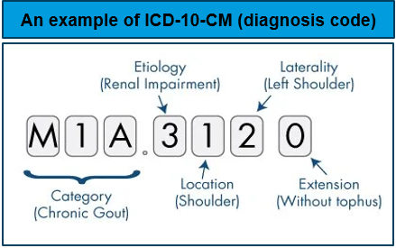
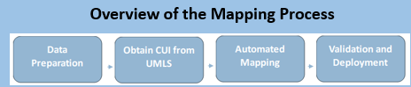
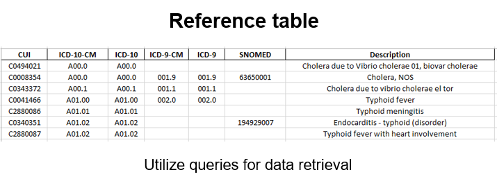
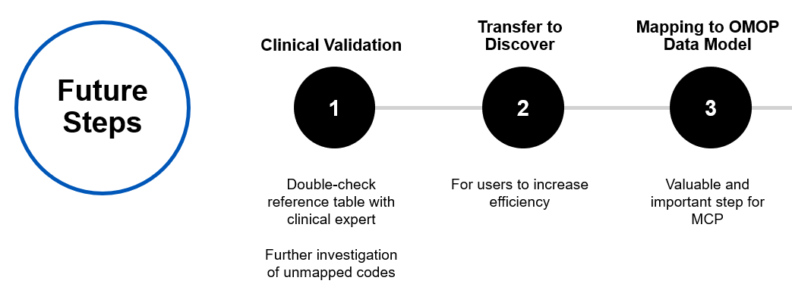

# Unlocking the Potential of Healthcare Informatics through Disease Code Mapping

**Bridging the Gap Between Disease Names and Standardized Codes**

## Table of Contents
1. [Introduction](#introduction)
2. [Problem Statement](#problem-statement)
3. [Objectives](#objectives)
4. [Methodology](#methodology)
5. [Results](#results)
6. [Conclusion](#conclusion)

## Introduction
In the world of healthcare, accurate diagnosis codes are crucial for patient cohort identification and data-driven decisions. This project focuses on mapping various diagnosis codes to simplify patient identification and streamline data analysis.

## Problem Statement
Start-up companies often face challenges in obtaining corresponding codes for disease names, impeding the construction of comprehensive patient cohorts. Diagnostic codes are essential tools in healthcare for identifying patient cohorts, facilitating research, and driving evidence-based decision-making. However, as the coding landscape has evolved, accurately mapping disease codes across different coding systems has become a significant challenge. In the context of the Mayo Clinic Platform (MCP), which collaborates with companies and health institutions to define cohorts, efficient disease code mapping is vital for expanding patient identification, regardless of the diagnostic coding system used.

## Objectives
The primary goal is to create an efficient mapping technique that bridges the gap between disease names and standardized codes, thereby streamlining the process of identifying accurate and standardized codes. An algorithm will be developed to be deployed in MCP data to extract or find patients with any diagnosis code.

## Methodology
### Mapping Process

My approach involves developing heuristics and guidelines for precise translations between different coding systems, such as SNOMED CT and ICD-10-CM. The mapping process considers various relationships between concepts, including one-to-one and many-to-one mappings.

### Leveraging UMLS for Mapping
The Unified Medical Language System (UMLS) plays a pivotal role in bridging concepts between ICD codes and SNOMED CT.

## Results
### Conversion Process Overview
- **Finding a Reliable Source for All Diagnosis Codes**
- **Linking Diagnosis Codes to CUIs (Concept Unique Identifiers)**
- **Creation of a Reference Table**

## Conclusion

In wrapping up our exploration into healthcare informatics through disease code mapping, we've charted a course toward greater cohesion between disease names and standardized codes. Our journey aimed to address the pressing challenges encountered by start-up companies in constructing comprehensive patient cohorts, equipping healthcare practitioners and researchers with invaluable data-driven insights.

Our meticulous methodology, incorporating the development of heuristics, guidelines, and leveraging the Unified Medical Language System (UMLS), has yielded a robust mapping technique capable of navigating the intricate landscape of coding systems. This technique, bolstered by the Concept Unique Identifier (CUI) and fostered by collaborative efforts with the Mayo Clinic Platform (MCP), signals a paradigm shift towards seamless integration and interoperability in healthcare data analytics.

Our results speak volumes about the efficacy of our approach, showcasing successful translations of concepts between ICD codes and SNOMED CT. Though challenges persist, particularly in mapping certain codes, our project lays the groundwork for future endeavors, including clinical validation and transitioning to the Discover environment. Additionally, our envisioned mapping to the Observational Medical Outcomes Partnership (OMOP) data model promises to align our efforts with industry standards, facilitating broader adoption and interoperability.

By harnessing the power of computer science, we've not only developed innovative algorithms but also showcased the transformative potential of technologies like Python, SparkSQL, and data visualization tools. These skills, coupled with comprehensive documentation and clear communication, ensure the reproducibility and scalability of our data analysis processes, propelling the field of healthcare informatics forward.

Reflecting on our journey, it becomes evident that efficient disease code mapping transcends technical endeavors; it opens doors to improved patient outcomes, informed decision-making, and transformative healthcare practices. Through collaboration, innovation, and an unwavering commitment to excellence, we stand poised to unlock new horizons in healthcare informatics, ushering in a future where data becomes a catalyst for positive change.
